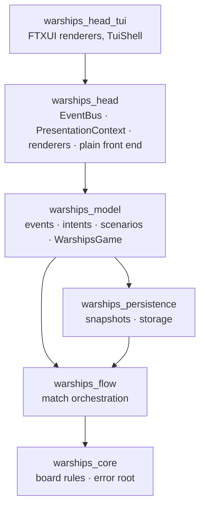
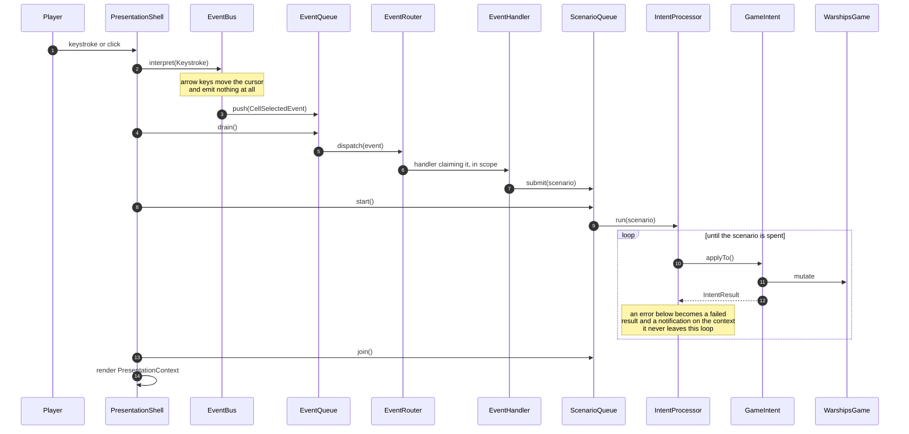

# WarShips Game Application

A terminal battleships game in C++20, built as a study in keeping game logic and
presentation genuinely apart.

## Features

### The game

- **Fleet placement** by hand or shuffled, on boards from 8×8 to 20×20
- **A hunting opponent** that remembers where it has fired and works outwards from a hit
  until the ship is finished
- **Three skills** — scanner, double damage and random strike — earned by sinking a ship

### Saves

- **As many as you like**, each named by the player and listed newest first
- **Browsed and deleted** from a list of their own
- **Loading one and saving again updates it**, rather than leaving a duplicate behind
- The battle log travels with the save, so a loaded game reads back its own history

### Two front ends

|                        |                                                           |
|------------------------|-----------------------------------------------------------|
| `cpp_warships`         | the full FTXUI interface, with colour, themes and a mouse |
| `cpp_warships --plain` | plain text, naming no drawing library at all              |

## Architecture

### The layers

Four layers, each its own CMake target, each reaching only inwards.

`warships_head` links **without any drawing library**. The plain front end lives in that
target on purpose, so leaking an FTXUI include into shared code breaks the build rather
than escaping notice.

### Two rules that hold it together

#### Presentation cannot change the game

It is handed `const ApplicationContext&`. Asking for a change is what events are for.

#### Navigation is derived, not requested

Which screen shows follows from the match phase and two presentation flags. Nothing ever
says "go to that screen".

### One turn of the machine

### Errors stop at one place

`IntentProcessor` is a hard membrane: anything thrown beneath it becomes a failed
`IntentResult` and a notice the player reads. Nothing above it holds a `catch`.

> The full class diagram and the reasoning behind each decision are in
> [architecture.md](architecture.md).

## Everything runs on one thread

There is no asynchronous code anywhere — no threads, no futures, no callbacks waiting on
anything. A keystroke is read, turned into an event, acted on and drawn, all before the
next one is read.

### The seam is already there

That is a deliberate simplification rather than an oversight.

- **`ScenarioQueue` is an interface.** Its only implementation, `SyncScenarioQueue`, drains
  inline on `start()` and returns immediately from `join()`. Those two calls exist purely
  so a threaded implementation could be dropped in without any caller changing: `start()`
  would spawn, `join()` would wait.
- **`EventQueue` already separates arriving from acting**, so an event raised while another
  is being handled waits for the next turn instead of lengthening the current one.

### What it buys

The whole game can be driven by piping keystrokes into the plain front end and reading the
frames back — which is how every feature here has been tested.

## Building

### Commands

| command                | description                       |
|------------------------|-----------------------------------|
| `make compile`         | build, reusing previous artifacts |
| `make rebuild-debug`   | build from scratch in Debug       |
| `make rebuild-release` | build from scratch in Release     |
| `make test`            | run every library's tests         |

### Flags

All commands take `BUILD_DIR`, `CPP_COMPILER`, `C_COMPILER` and `BUILD_TYPE`; `compile`
also takes `CLEAN=1`.

### Build types

Tests are built only in Release, so `make test` fails with "No tests were found" after
`make rebuild-debug`. WebAssembly builds never include tests.

### Dependencies

FTXUI and nlohmann/json are fetched by CMake on first configure.

### In a browser

The FTXUI front end also builds to WebAssembly with Emscripten, so it can run inside a
web page on a terminal emulator such as xterm.js.

| command                    | description                                                     |
|----------------------------|-----------------------------------------------------------------|
| `make webassembly`         | build the page and its two Emscripten outputs into `build-wasm/dist/` |
| `make webassembly-preview` | build, then serve that directory on the first free port from `8000` |

The game loop waits on keys, so it runs on a worker thread. Threads need shared memory,
which a browser only allows on a cross-origin isolated page — one served with
`Cross-Origin-Opener-Policy: same-origin` and `Cross-Origin-Embedder-Policy: require-corp`.
`external/web/serve.py` sends both; any page hosting the game has to do the same.

Saves go into the browser's local storage rather than a filesystem, so they outlive the
page. Which storage a build uses is settled when it is configured, so no code asks at
runtime which machine it is on.

Every push builds the directory and keeps it as a workflow artifact; pushing a `v*` tag
publishes it, with checksums, as a GitHub release.

## A note on scope

This began as a university laboratory exercise and is kept as a learning project. The
architecture above was arrived at by rewriting the original console application in stages,
and the history reflects that. It is not maintained as a product.
